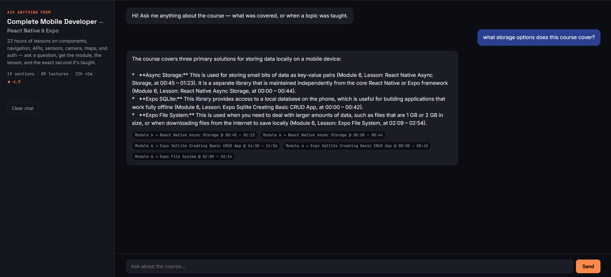

# LectureLens

Answers student questions about a Udemy course's video content, citing the
exact module, lesson, and timestamp where the topic was taught.

## Architecture

```
SRT/VTT files → parse → chunk (with timestamps) → embed (local, all-MiniLM-L6-v2) → Qdrant
                                                                                        ↓
user question → input guardrail (history-aware) → query condensation (multi-turn)
              → embed + HyDE → retrieve (10 candidates) → LLM rerank → top 5
              → answer generation (cited, history-aware)
```

Pipeline stages, mapped to the original reference diagram:

| Stage | Diagram equivalent | Status |
|---|---|---|
| Chunking + embedding | Data ingestion | Done (local embeddings, no rate limits) |
| Input guardrail | Guardrails / PII detection | Done: single on-topic/off-topic classifier, history-aware |
| Query condensation | (multi-turn extension, not in original diagram) | Done: resolves follow-ups like "what about on iOS?" |
| HyDE | HyDE | Done: bridges spoken-lecture phrasing vs. formal questions |
| Reranking | RANK | Done: LLM reranks merged candidates before final selection |
| Query routing (SQL/vector/S3) | Query Routing | **Not applicable**: single course, single vector store, nothing to route between |
| Step-back / query decomposition | More Abstraction / Decompose | Not implemented. Step-back skipped because HyDE and condensation cover similar ground; decomposition is listed under Future scope |

## Setup

1. **Gemini API key** (free): https://aistudio.google.com/apikey (used only
   for guardrail/condense/HyDE/rerank/answer LLM calls, not embeddings).
2. **Qdrant Cloud free cluster**: https://cloud.qdrant.io
3. Backend:
   ```
   npm install
   cp .env.example .env
   # fill in GEMINI_API_KEY, QDRANT_URL, QDRANT_API_KEY
   ```
4. Frontend:
   ```
   cd frontend
   npm install
   ```

## Ingest your course

```
npm run ingest -- "/path/to/class-subtitle"
```

Walks `module N/lesson-folder/*.srt|.vtt`, chunks (~45s per chunk), embeds
locally (no API, no rate limits), upserts to Qdrant. Re-run after any change
to `cleanLessonTitle`/`cleanModuleName` in `src/ingest.js`, and delete the
Qdrant collection first so old and new casing don't mix.

## Run it

```
npm start                      # backend on :3001
cd frontend && npm run dev     # frontend on :5173
```

## Evaluation

Retrieval here is measured, not asserted. `eval/questions.json` holds 30
questions labeled with the module, lesson, and timestamp window that actually
answers each one. `npm run eval` runs every question through the same
`retrieve()` function the server uses, with pipeline stages switched on one at
a time, against the live Qdrant index.

Reproduce the published numbers without spending any API quota:

```
npm run eval -- --cache-only
```

Every Gemini response is cached in `eval/cache/llm.json`, which is committed,
so a cache-only run replays the exact calls behind the tables below. A run
that hits any API error refuses to write results at all, so a partially failed
run cannot quietly turn into a published number.

A retrieved chunk counts as a hit only if it comes from the labeled lesson and
overlaps the labeled time window by at least one second. Landing in the right
lesson at the wrong timestamp is tracked separately as a lesson hit.

**Single-turn questions**

| Configuration | n | Hit@1 | Hit@5 | MRR@5 | Lesson hit@5 | Pool recall@10 |
|---|---|---|---|---|---|---|
| Vector search only | 24 | 46% | 63% (15/24) | 0.524 | 88% | 63% |
| + HyDE | 24 | 46% | 67% (16/24) | 0.549 | 92% | 75% |
| + Rerank (no HyDE) | 24 | 54% | 63% (15/24) | 0.583 | 88% | 63% |
| + HyDE + Rerank (production) | 24 | 67% | 71% (17/24) | 0.688 | 88% | 75% |

**Multi-turn follow-ups** (every row runs HyDE and rerank; only the handling
of conversation history changes)

| Configuration | n | Hit@1 | Hit@5 | MRR@5 | Lesson hit@5 | Pool recall@10 |
|---|---|---|---|---|---|---|
| Follow-up alone (no condensation) | 6 | 50% | 50% (3/6) | 0.500 | 67% | 50% |
| Previous turn + follow-up, concatenated | 6 | 17% | 67% (4/6) | 0.375 | 83% | 67% |
| LLM condensation (production) | 6 | 100% | 100% (6/6) | 1.000 | 100% | 100% |

**Citation accuracy**, measured on full production answers to all 30
questions: 56 of 57 citations verified (98%). One answer cited a timestamp
that matched no retrieved excerpt, no answer cited a lesson that was not among
its excerpts, and every answer carried at least one parseable citation.

### What the numbers actually say

- **Reranking cannot fix retrieval, only ordering.** Rerank alone changed
  hit@5 on exactly zero questions (+0 newly hit, -0 newly missed), because it
  reorders a pool that vector search has already fixed. What it moved was
  hit@1, 46% to 54%, and MRR, 0.524 to 0.583.
- **HyDE is the stage that changes what gets found at all.** It lifts pool
  recall@10 from 63% to 75%, because a hypothetical instructor-voice answer
  matches spoken transcript phrasing better than a student's question does.
- **The two compose.** HyDE widens the pool, rerank then picks better inside
  it: hit@1 46% to 67%, MRR 0.524 to 0.688.
- **Condensation is the whole story on follow-ups.** Concatenating the
  previous turn beats using the follow-up alone on hit@5, but it drags the
  earlier topic's vocabulary into the query and wrecks hit@1 (17%). Rewriting
  the follow-up into a standalone question first is what makes it work.

### Caveats

Read these before quoting any number above.

- **n is small.** 24 single-turn and 6 multi-turn questions. One question is
  worth about 4 percentage points, so a gap of one or two questions is noise.
  The per-question win and loss table in `eval/results.md` is more
  informative than the headline percentages.
- **HyDE is sampled once at temperature 0.4**, so its rows would shift a
  little on a fresh run. The cache pins one sample, it does not make the
  number stable in principle.
- **Question provenance matters, and it shows.** 22 questions were generated
  and are marked `"author": "generated"`; 8 were written by hand, before
  reading any transcript, and are marked `"author": "preet"`. The hand-written
  ones score lower: 5 of 8 hit@5 against 12 of 16 for the generated ones, in
  the production configuration. Questions written by a model over the same
  corpus share vocabulary with it, which flatters retrieval. The hand-written
  subset is the more honest signal, and it is also the smaller one.
- **Four of the seven production misses land in the right lesson** but outside
  the labeled window, so a student would still have been sent to the right
  video, just not the right minute. The other three miss the lesson entirely.
- **One label is weaker than the rest.** The question about keeping a settings
  screen outside a tab layout is answered only implicitly by the course, which
  states that files inside the tabs directory become tabs but never addresses
  the symptom. It is labeled against that statement, and the production
  pipeline misses it.

## Deployment

### Backend (Render)

Set these environment variables in your [Render](https://render.com) dashboard:

| Variable | Description |
|---|---|
| `GEMINI_API_KEY` | Gemini API key |
| `QDRANT_URL` | Qdrant cluster URL |
| `QDRANT_API_KEY` | Qdrant API key |
| `QDRANT_COLLECTION` | Qdrant collection name |
| `FRONTEND_URL` | Your Vercel frontend URL (no trailing slash) |

Set the build command to `npm install && npm run build`. The build step
downloads the embedding model, because Render's runtime disk is wiped on
every spin-down and the model would otherwise be re-fetched on each cold
start. The free tier still sleeps when idle; the frontend pings `/health` on
load and shows a "waking up" banner while that happens.

### Keeping the Qdrant free cluster alive

Qdrant Cloud suspends free clusters after a week without use and deletes
them after four. `.github/workflows/qdrant-keepalive.yml` reads one point
every 3 days and fails (triggering a GitHub email) if the cluster is gone.
Add `QDRANT_URL` and `QDRANT_API_KEY` as repository secrets. GitHub pauses
scheduled workflows after 60 days without repository activity, so check the
Actions tab if the repo goes quiet for that long.

### Frontend (Vercel)

Set `VITE_API_URL` to your Render backend URL in the [Vercel](https://vercel.com) project settings (Environment Variables).

## Screenshots



## Known limitations (deliberate scope decisions, not oversights)

- **Single course only.** Query routing across multiple courses/data sources
  is architecturally not needed here, since there's one vector store. See Future
  Scope below for what multi-course support would require.
- **Guardrail is a single classifier call**, not the full PII/competitor
  detection pipeline from the reference diagram. That's appropriate for a
  single-course student support bot.
- **Chat history is per-browser** (`localStorage`), not synced across
  devices or persisted server-side.

## Future scope: turning this from a project into a product

Ranked roughly by effort-to-value if this continues past the assignment:

1. **Multi-course support with real query routing.** Add a course selector,
   tag every chunk with a `course_id`, and route retrieval to the right
   course's data. This is where the "Query Routing" diagram node actually
   becomes applicable, unlike now.
2. **Analytics / instructor dashboard.** Log every question, its condensed
   query, retrieval scores, and whether the guardrail blocked it, to a small
   database (SQLite is enough to start). Surface: most-asked topics, questions
   with weak retrieval scores (signals a content gap or confusing lesson),
   and blocked/off-topic queries. Needs real usage data to be convincing, so
   don't ship an empty dashboard.
3. **Course outline sidebar.** Let students browse modules/lessons directly
   instead of only asking questions. Useful for students who don't know
   what to ask yet.
4. **Query decomposition for compound questions** ("explain OAuth and push
   notifications"): split into sub-questions, retrieve for each, merge.
5. **Streaming answers.** Stream the LLM response token-by-token to the UI
   instead of waiting for the full answer. Meaningful perceived-speed
   improvement, no architecture change needed.
6. **Feedback loop.** Thumbs up/down on answers, stored alongside the
   analytics log. Lets you distinguish "low retrieval score but actually a
   fine answer" from "high score but wrong answer."
7. **Server-side chat history + accounts.** Move history off `localStorage`
   so it syncs across devices; needed if this ever has real multiple users.
8. **Faithfulness/hallucination check.** A second LLM pass verifying the
   final answer's claims are actually supported by the cited excerpts, before
   returning it. Real value, but needs careful testing to avoid false
   rejections of good answers.
9. **Video timestamp deep-linking.** If lesson videos are hosted somewhere
   with seek-to-timestamp URLs (e.g. an internal LMS), turn the citation
   timestamps into clickable links that jump straight to that second.